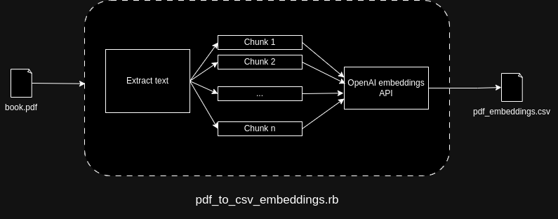
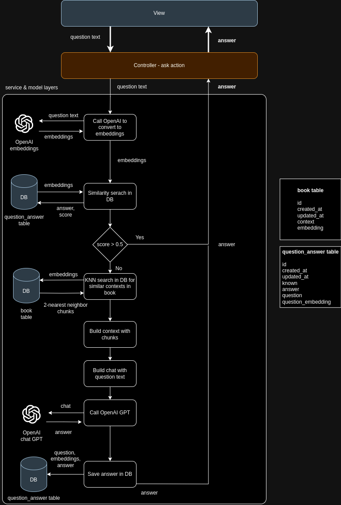
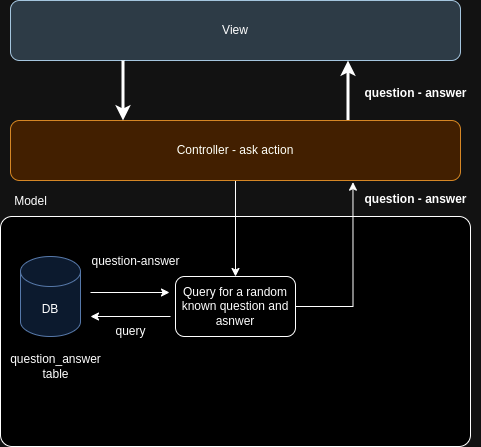

# Ask Sherlock Holmes

An _[askmybook](https://github.com/slavingia/askmybook)_ clone built with Rails and React. 

Ask anything about the contents of _The Adventures of Sherlock Holmes_ by Sir Arthur Conan Doyle. Some sample quiz questions are available in the resources below:

[The Adventures of Sherlock Holmes trivia questions](https://www.funtrivia.com/trivia-quiz/Literature/)

[The Adventures of Sherlock Holmes Quiz](https://bookroo.com/book-quiz/the-adventures-of-sherlock-holmes)

## Technical Design

### PDF to CSV

The pdf to csv script works as shown in the following diagram:



1. It validates the aguments sent via the command line. 
2. If all arguments are ok, then it opens the provided pdf file. 
3. If the pdf file was opened successfuly, then it extract its text.
4. It separates the text into chunks by using a recursive character text splitter.
5. Using OpenAI API embedding endpoint, it calculates the embeddings for each chunk.
6. The chunks and embeddings are saved into a .csv file.

### askmybook

There are two actions that can happen in the application, 'ask' and 'lucky'. 

#### Ask action

The 'ask' action answers the user's question by looking for a similar context in the book chunks and sending it to OpenAI's GPT model 4. Subsequently, the generated answers are stored in a 'question_answer' table. This enables the system to retrieve and return stored responses when similar questions are received. The overall process of the 'ask' action is illustrated in the diagram below:



The application was designed based on a model-view-controller (MVC) architecture, with the incorporation of an additional service layer to house the business logic.

The primary purpose of integrating a database is to minimize API call expenses and verify the existence of answers for semantically similar questions within the 'question_answer' table. As the application scales, there's potential for optimization by implementing a caching system, such as Redis, to enhance the efficiency of system responses.

Furthermore, the database has a book table where, during the db:seed stage, the pdf_embeddings.csv file is imported into the db. This integration facilitates searches within the book's chunks, contributing to the overall performance of the system.

#### Lucky action

The 'lucky' action is simpler. It looks for a random 'known' question and answer which is returned to the view layer. As part of the db:seed stage, ten question-answer pairs with the attribute 'known' set to true are inserted into the database. When the user clicks the 'lucky' button, the system executes a query on the database, filtering for entries where 'known' is true, randomizes their order, and retrieves the first result.



## Getting Started

These instructions will get you a copy of the project up and running on your local machine for development and testing purposes. See deployment for notes on how to deploy the project on a live system.

### Prerequisites

#### NodeJS and npm

Make sure to have [nodejs and npm installed](https://docs.npmjs.com/downloading-and-installing-node-js-and-npm) in your local system. This application was built with node v16.14.0 and npm v8.3.1.

#### Yarn

Follow the instructions in the [official website](https://classic.yarnpkg.com/en/docs/install#debian-stable). This project uses v1.22.21.

#### Ruby / Ruby on Rails

[Install Ruby](https://www.ruby-lang.org/en/documentation/installation/) and [Ruby on Rails](https://guides.rubyonrails.org/v5.0/getting_started.html#installing-rails). This application was built with Ruby v3.1.2 and Rails v7.0.8.

#### Postgres

This application requires a [postgresql v15+ installed](https://www.postgresql.org/download/) in your local machine.

Additionally, the [pgvector extension](https://www.postgresql.org/download/) must be installed.

```sh
cd /tmp
git clone --branch v0.5.1 https://github.com/pgvector/pgvector.git
cd pgvector
make
make install # may need sudo
```

### Installation

A step by step series of examples that tell you how to get a development env running.

#### Step 1. Clone the repo and cd to the root directory

```sh
git clone https://github.com/mmichelj/askmybook.git
```
```sh
cd askmybook
```

#### Step 2. Install the dependencies

```
bundle install
```

#### Step 3. Generate embeddings from your PDF book

You will use the pdf_to_csv_embeddings.rb script to generate your embeddings.

Run the script passing the name of your pdf file and your OpenAI key as arguments

```sh
ruby app/assets/scripts/pdf_to_csv_embeddings.rb -p /path/to/your/pdf/book.pdf -k sk-OpenAIKey
```
Move the generated embeddings to your public path
```sh
sudo mv -f pdf_embeddings.csv /public
```
#### Step 4. Defining secrets

Add your OpenAI key and DB user/password as a Rails secrets by modifying credentials.yml.enc

```sh
# Change 'code' to your preferred text editor
EDITOR="code --wait" bin/rails credentials:edit
```

Sample:

```yml
OPENAI_API_KEY: sk-MyOpenAiKey
ASKMYBOOK_DATABASE_USER: username
ASKMYBOOK_DATABASE_PASSWORD: password
ASKMYBOOK_PROD_DATABASE_USER: produser
ASKMYBOOK_PROD_DATABASE_PASSWORD: prodpassword
``` 

#### Step 5. Database setup

If you have not done it, install postgres

```sh
sudo apt install postgresql-15 postgresql-contrib libpq-dev
```

Create a new role

```sh
sudo -u postgres createuser -s book -P
```

Run the creation scripts
```sh
rails db:create
```

Run the migrations
```sh
rake db:migrate
```

Seed the tables
```sh
rake db:seed
```

#### Step 6. Run the dev environment

```sh
rails assets:precompile
```

```sh
bin/dev
```

## Deployment

This application is hosted in heroku. To deploy it you will need to create a new application with a standard postgres database.

Create heroku app
```sh
heroku apps:create
```

Add a postgres db
```sh
heroku addons:create heroku-postgresql:standard-0 -a example-app --block-logs
```

Create the user and password for the application using the heroku app management.

Deploy the application
```sh
git push heroku main
```

Migrate the db

```sh
heroku run rake db:migrate
```

You will have to manually seed the tables in the database using pgAdmin as heroku currently does not provide admin privileges on its databases. You can do this by exporting the initial db data from your local env and importing it in the newly created tables.

Additonal information is available in the [heroku website](https://devcenter.heroku.com/articles/getting-started-with-rails7).

## Built With

* Ruby v3.1.2 
* Rails v7.0.8.
* node v16.14.0 
* npm v8.3.1
* yarn v1.22.21.

## Acknowledgments

* Readme template taken from [PurpleBooth](https://gist.github.com/PurpleBooth/109311bb0361f32d87a2)
* OpenAI api [documentation](https://platform.openai.com/docs/api-reference)
* pgvector [documentation](https://github.com/pgvector/pgvector)
* neighbors [documentation](https://github.com/ankane/neighbor)